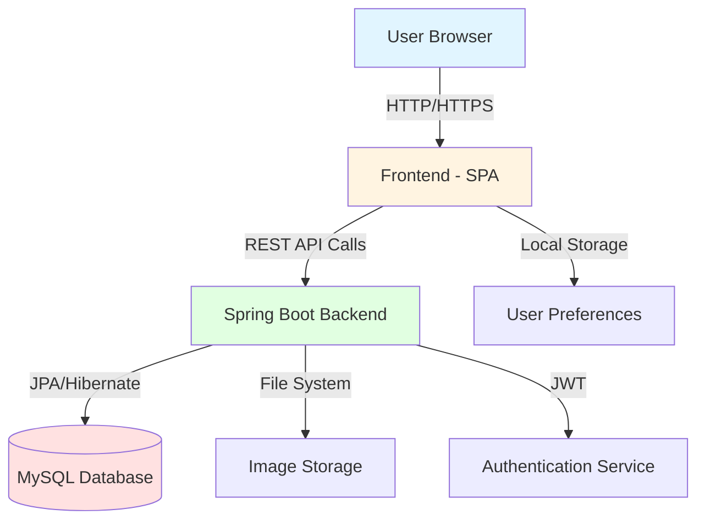

<div align="center">

# 🌿 MediPlant - Medicinal Plant Analysis System


**A full-stack web application for identifying medicinal plants and discovering their healing properties**

[Features](#-features) • [Architecture](#-architecture) • [Quick Start](#-quick-start) • [API Documentation](#-api-documentation) • [Contributing](#-contributing)

</div>

---

## 📋 Table of Contents

- [Overview](#-overview)
- [Features](#-features)
- [Architecture](#-architecture)
- [Technology Stack](#-technology-stack)
- [Quick Start](#-quick-start)
- [Project Structure](#-project-structure)
- [API Documentation](#-api-documentation)
- [Configuration](#-configuration)
- [Docker Deployment](#-docker-deployment)
- [Contributing](#-contributing)
- [License](#-license)

---

## 🌟 Overview

**MediPlant** is a comprehensive medicinal plant identification and information system consisting of:

- 🔹 **Backend API**: RESTful Spring Boot application with JWT authentication, image processing, and advanced search capabilities
- 🔹 **Frontend Web App**: Modern, responsive single-page application with dual-theme support and interactive UI
- 🔹 **Database**: Comprehensive medicinal plant database with symptoms, properties, and safety information

<details>
<summary><b>Key Capabilities</b></summary>

- ✅ Multi-modal plant search (name, symptoms, visual features, image recognition)
- ✅ User authentication and authorization with JWT
- ✅ Image upload and plant identification
- ✅ Advanced filtering and comparison tools
- ✅ Community features (reviews, ratings, Q&A)
- ✅ Responsive design with light/dark themes
- ✅ RESTful API with Swagger documentation

</details>

---

## ✨ Features

### Backend Features

<table>
<tr>
<td width="50%">

**🔐 Authentication & Security**
- JWT-based authentication
- Role-based access control (User/Admin)
- Secure password encryption
- Session management

**🌱 Plant Management**
- CRUD operations for plants
- Advanced search & filtering
- Symptom-based recommendations
- Plant properties & compounds

</td>
<td width="50%">

**📸 Image Processing**
- Plant image upload
- Image recognition API
- Multi-format support
- Thumbnail generation

**📊 Admin Dashboard**
- User management
- Plant data management
- Review moderation
- System analytics

</td>
</tr>
</table>

### Frontend Features

<table>
<tr>
<td width="50%">

**🔍 Search Capabilities**
- Text-based search
- Symptom search
- Visual feature filtering
- Image recognition
- Voice search support

**🎨 User Experience**
- Light/Dark theme toggle
- Animated onboarding
- Skeleton loading states
- Smooth transitions

</td>
<td width="50%">

**📱 Responsive Design**
- Mobile-first approach
- Tablet & desktop optimization
- Touch-friendly interface
- Progressive enhancement

**🛠️ User Tools**
- Favorites system
- Search history
- Plant comparison
- User preferences

</td>
</tr>
</table>

---

## 🏗️ Architecture



### System Components

| Component | Technology | Purpose |
|-----------|-----------|---------|
| **Frontend** | Vanilla JS, CSS3, HTML5 | Single-page application with modular architecture |
| **Backend** | Spring Boot 3.2.12, Java 21 | RESTful API with business logic |
| **Database** | MySQL 8.0 / H2 (dev) | Persistent data storage |
| **Authentication** | JWT, Spring Security | Secure user authentication |
| **API Docs** | SpringDoc OpenAPI 3.0 | Interactive API documentation |
| **Containerization** | Docker, Docker Compose | Easy deployment and scaling |

---

## 💻 Technology Stack

### Backend

```yaml
Core:
  - Java: 21
  - Spring Boot: 3.2.12
  - Spring Security: JWT Authentication
  - Spring Data JPA: Data Access Layer

Database:
  - MySQL: 8.0+ (Production)
  - H2: In-memory (Development)

Build & Tools:
  - Maven: 3.6+
  - Lombok: Code Generation
  - MapStruct: Object Mapping
  - SpringDoc: API Documentation
```

### Frontend

```yaml
Core:
  - HTML5: Semantic Markup
  - CSS3: Modern Styling
  - JavaScript: ES6+ (Vanilla)

Features:
  - Modular Architecture
  - Theme Management
  - Local Storage API
  - Fetch API for Backend Communication

Design:
  - Font Awesome: Icons
  - Custom CSS Variables: Theming
  - CSS Grid & Flexbox: Layouts
  - CSS Animations: Smooth Transitions
```

---

## 🚀 Quick Start

### Prerequisites

```bash
# Required
- JDK 21+
- Maven 3.6+
- MySQL 8.0+ (or use H2 for development)
- Modern Web Browser

# Optional
- Docker & Docker Compose
- Git
```

### Installation

<details>
<summary><b>1. Clone the Repository</b></summary>

```bash
git clone https://github.com/yourusername/Med_Plant_Analysis.git
cd Med_Plant_Analysis
```

</details>

<details>
<summary><b>2. Backend Setup</b></summary>

```bash
# Navigate to backend directory
cd medicinal-plant-backend

# Option A: Run with Maven (Development)
mvn spring-boot:run

# Option B: Build and run JAR
mvn clean package
java -jar target/medicinal-plant-backend-1.0.0.jar

# Option C: Docker Compose (Production)
docker-compose up --build
```

Backend will start on: `http://localhost:8080`

</details>

<details>
<summary><b>3. Frontend Setup</b></summary>

```bash
# Navigate to frontend directory
cd medicinal-plant-identifier

# Option A: Simple HTTP Server (Python)
python -m http.server 3000

# Option B: Node.js HTTP Server
npx http-server -p 3000

# Option C: Direct file access
# Open index.html in your browser
```

Frontend will be available on: `http://localhost:3000`

</details>

### Quick Test

```bash
# Test backend API
curl http://localhost:8080/api/plants/all

# Test H2 Console (dev mode)
# Open: http://localhost:8080/h2-console
# JDBC URL: jdbc:h2:mem:medicinalplantdb
# Username: sa
# Password: (empty)
```

---

## 📂 Project Structure

```
Med_Plant_Analysis/
│
├── medicinal-plant-backend/          # Spring Boot Backend
│   ├── src/
│   │   ├── main/
│   │   │   ├── java/com/medicinal/plant/
│   │   │   │   ├── config/          # Security, CORS, JPA configs
│   │   │   │   ├── controller/      # REST endpoints
│   │   │   │   ├── service/         # Business logic
│   │   │   │   ├── repository/      # Data access layer
│   │   │   │   ├── model/           # Entities & DTOs
│   │   │   │   ├── exception/       # Exception handling
│   │   │   │   └── util/            # Helper utilities
│   │   │   └── resources/
│   │   │       ├── application.yml  # Main configuration
│   │   │       ├── data.sql         # Initial data
│   │   │       └── static/          # Frontend integration
│   │   └── test/                    # Unit & integration tests
│   ├── pom.xml                      # Maven dependencies
│   ├── Dockerfile                   # Container configuration
│   └── docker-compose.yml           # Multi-container setup
│
├── medicinal-plant-identifier/       # Frontend SPA
│   ├── index.html                   # Main entry point
│   ├── scripts/
│   │   ├── main.js                  # Application initialization
│   │   ├── modules/                 # Feature modules
│   │   │   ├── api-client.js       # Backend API integration
│   │   │   ├── plant-database.js   # Plant data management
│   │   │   ├── search-engine.js    # Search functionality
│   │   │   ├── theme-manager.js    # Theme switching
│   │   │   ├── ui-manager.js       # UI components
│   │   │   └── user-preferences.js # User settings
│   │   └── utils/                   # Helper functions
│   ├── styles/
│   │   ├── main.css                # Global styles
│   │   ├── animations.css          # Keyframe animations
│   │   ├── components/             # Component styles
│   │   └── themes/                 # Light/Dark themes
│   └── assets/
│       ├── data/plant-data.json    # Plant database
│       ├── images/                  # Plant & UI images
│       └── fonts/                   # Custom fonts
│
└── README.md                         # This file
```

---

## 📚 API Documentation

### Base URL

```
http://localhost:8080/api
```

### Authentication Endpoints

| Method | Endpoint | Description | Auth Required |
|--------|----------|-------------|---------------|
| `POST` | `/users/register` | Register new user | ❌ |
| `POST` | `/users/login` | User login | ❌ |
| `GET` | `/users/profile` | Get user profile | ✅ |
| `PUT` | `/users/profile` | Update profile | ✅ |

### Plant Endpoints

| Method | Endpoint | Description | Auth Required |
|--------|----------|-------------|---------------|
| `GET` | `/plants/all` | Get all plants | ❌ |
| `GET` | `/plants/{id}` | Get plant by ID | ❌ |
| `GET` | `/plants/search?query=aloe` | Search plants | ❌ |
| `POST` | `/plants` | Create plant | ✅ Admin |
| `PUT` | `/plants/{id}` | Update plant | ✅ Admin |
| `DELETE` | `/plants/{id}` | Delete plant | ✅ Admin |

### Search Endpoints

| Method | Endpoint | Description | Auth Required |
|--------|----------|-------------|---------------|
| `POST` | `/search/by-symptoms` | Search by symptoms | ❌ |
| `POST` | `/search/by-visual-features` | Visual feature search | ❌ |
| `POST` | `/images/recognize` | Image recognition | ✅ |

### Admin Endpoints

| Method | Endpoint | Description | Auth Required |
|--------|----------|-------------|---------------|
| `GET` | `/admin/users` | List all users | ✅ Admin |
| `GET` | `/admin/stats` | System statistics | ✅ Admin |
| `PUT` | `/admin/users/{id}/role` | Change user role | ✅ Admin |

### Interactive Documentation

- **Swagger UI**: [http://localhost:8080/swagger-ui.html](http://localhost:8080/swagger-ui.html)
- **API Docs JSON**: [http://localhost:8080/v3/api-docs](http://localhost:8080/v3/api-docs)

### Example Request

```bash
# Search plants by symptoms
curl -X POST http://localhost:8080/api/search/by-symptoms \
  -H "Content-Type: application/json" \
  -d '{
    "symptoms": ["inflammation", "pain"],
    "safetyLevel": "safe"
  }'
```

---

## ⚙️ Configuration

### Backend Configuration

<details>
<summary><b>Database Configuration</b></summary>

Edit `src/main/resources/application.yml`:

```yaml
spring:
  datasource:
    url: jdbc:mysql://localhost:3306/medicinal_plant_db
    username: your_username
    password: your_password
  jpa:
    hibernate:
      ddl-auto: update
    show-sql: true
```

</details>

<details>
<summary><b>JWT Configuration</b></summary>

Edit `application.yml`:

```yaml
jwt:
  secret: your-secret-key-min-256-bits
  expiration: 86400000  # 24 hours in milliseconds
```

</details>

<details>
<summary><b>Profile Configuration</b></summary>

```yaml
# Development (default)
spring.profiles.active: dev

# Production
spring.profiles.active: prod
```

</details>

### Frontend Configuration

<details>
<summary><b>API Endpoint Configuration</b></summary>

Edit `scripts/modules/api-client.js`:

```javascript
const API_BASE_URL = 'http://localhost:8080/api';
const API_TIMEOUT = 30000;
```

</details>

---

## 🐳 Docker Deployment

### Using Docker Compose

```bash
# Navigate to backend directory
cd medicinal-plant-backend

# Start all services
docker-compose up -d

# View logs
docker-compose logs -f

# Stop services
docker-compose down

# Remove volumes
docker-compose down -v
```

### Manual Docker Build

```bash
# Build backend image
docker build -t medicinal-plant-backend .

# Run MySQL container
docker run -d \
  --name medicinal-plant-mysql \
  -e MYSQL_ROOT_PASSWORD=rootpassword \
  -e MYSQL_DATABASE=medicinal_plant_db \
  -p 3306:3306 \
  mysql:8.0

# Run backend container
docker run -d \
  --name medicinal-plant-backend \
  -p 8080:8080 \
  -e SPRING_PROFILES_ACTIVE=prod \
  medicinal-plant-backend
```

### Docker Configuration

```yaml
# docker-compose.yml
services:
  mysql:
    image: mysql:8.0
    ports: ["3306:3306"]
    environment:
      MYSQL_DATABASE: medicinal_plant_db
      MYSQL_USER: plantuser
      MYSQL_PASSWORD: plantpassword
  
  backend:
    build: .
    ports: ["8080:8080"]
    depends_on: [mysql]
    environment:
      SPRING_PROFILES_ACTIVE: prod
```

---

## 🧪 Testing

### Backend Tests

```bash
# Run all tests
mvn test

# Run specific test class
mvn test -Dtest=PlantServiceTest

# Run with coverage
mvn clean test jacoco:report
```

### Frontend Testing

```bash
# Open index.html in browser
# Use browser DevTools console for debugging

# Check for JavaScript errors
# Test all features manually
```

---

## 🤝 Contributing

We welcome contributions! Please follow these guidelines:

### Development Workflow

1. **Fork** the repository
2. **Create** a feature branch (`git checkout -b feature/amazing-feature`)
3. **Commit** your changes (`git commit -m 'Add amazing feature'`)
4. **Push** to the branch (`git push origin feature/amazing-feature`)
5. **Open** a Pull Request

### Code Standards

- Follow Java coding conventions (backend)
- Use ESLint for JavaScript (frontend)
- Write meaningful commit messages
- Add tests for new features
- Update documentation as needed

---

## 📝 License

This project is licensed under the MIT License - see the [LICENSE](LICENSE) file for details.

---

## 👥 Authors & Contributors

<div align="center">

**Developed with ❤️ by the MediPlant Team**


</div>

---

## 📞 Support & Contact

<table>
<tr>
<td width="50%">

**🐛 Report Issues**
- [GitHub Issues](https://github.com/yourusername/Med_Plant_Analysis/issues)
- Include error logs
- Describe reproduction steps

</td>
<td width="50%">

**💬 Get Help**
- [Documentation](#-api-documentation)
- [FAQ](#faq)
- Email: support@mediplant.com

</td>
</tr>
</table>

---

## 🎯 Roadmap

- [ ] Mobile application (React Native)
- [ ] Advanced ML-based plant recognition
- [ ] Multi-language support
- [ ] Offline mode support
- [ ] Community forums
- [ ] Integration with health tracking apps
- [ ] Expert consultation feature
- [ ] Plant growing guides
- [ ] E-commerce integration

---

## 📊 Project Stats

<div align="center">


</div>

---

## FAQ

<details>
<summary><b>How do I change the database from H2 to MySQL?</b></summary>

Edit `application.yml` and set `spring.profiles.active: prod` to use MySQL configuration.

</details>

<details>
<summary><b>Can I use this project commercially?</b></summary>

Yes, this project is under MIT License. Check the LICENSE file for details.

</details>

<details>
<summary><b>How do I add new plants to the database?</b></summary>

Use the Admin API endpoints (`POST /api/plants`) or directly edit `data.sql` file.

</details>

<details>
<summary><b>Is there a mobile version?</b></summary>

Currently, the web app is responsive and works on mobile browsers. Native mobile apps are in the roadmap.

</details>

---

<div align="center">

### ⭐ Star us on GitHub — it motivates us a lot!

**Made with 🌿 and ☕**

[Back to Top](#-mediplant---medicinal-plant-analysis-system)

</div>